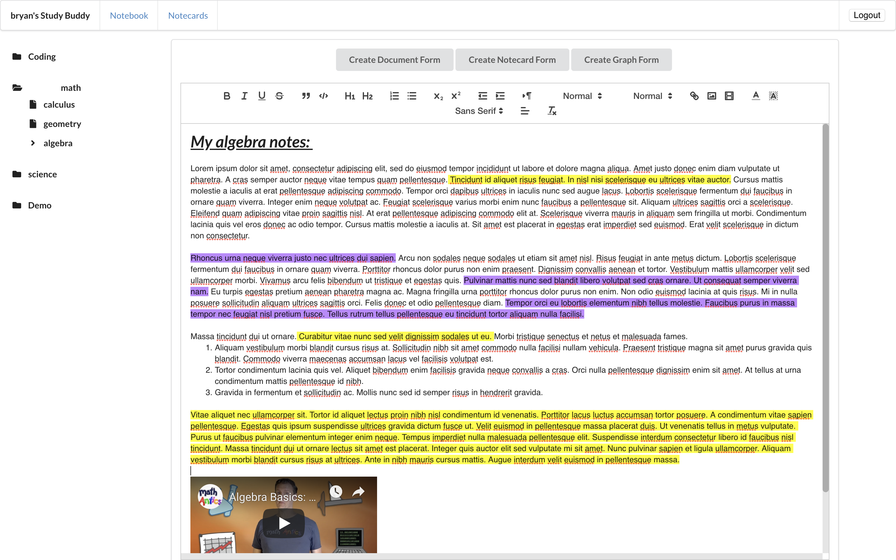
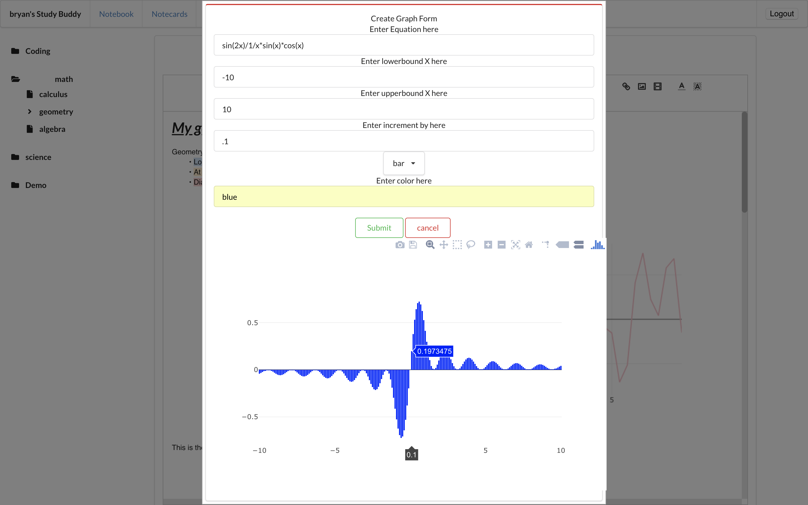
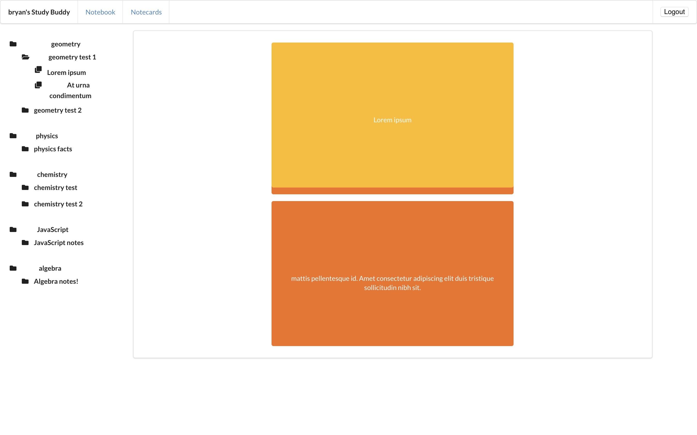

# Study Buddy

*Study Buddy*, a note taking app from a student for students.

## Application Features
- User can write notes on a document and change the styling of the text as the wish, and persist the changes.

- User can create new categories from their documents to be listed under

- User can add elements such as videos and images to the documents.

- User can create a graph with a given equation and save that graph as an image to later add to their document.

- User can create a notecard to study from

## Built With
- React
- Ruby
- Rails API utilizing Active Model Serializers
- Sqlite3 Database using ActiveRecord
- Math.js library
- react-Plot.ly.js
- React-Quill
- React Route
- ReactJS-Popup
- React-Confirm-Alert
- Redux

## Back-End Repository
https://github.com/bryanteng/study_buddy_backend

## Server-Side Install Instructions
1. Run `bundle install`
2. Run `rake db:migrate`
3. - Optional - Run `rake db:seed` to see dummy files
4. Run `rails s`

## Client-Side Install Instructions
1. Run `npm install`
2. Run `npm start`

## Contributing
[Contributing Guide](./CONTRIBUTING.md)

## Authors
- **Bryan Teng**

## License
[License](./LICENSE.md)

## Acknowledgments
- Big thank you to Tony Lam & Eric Kim
